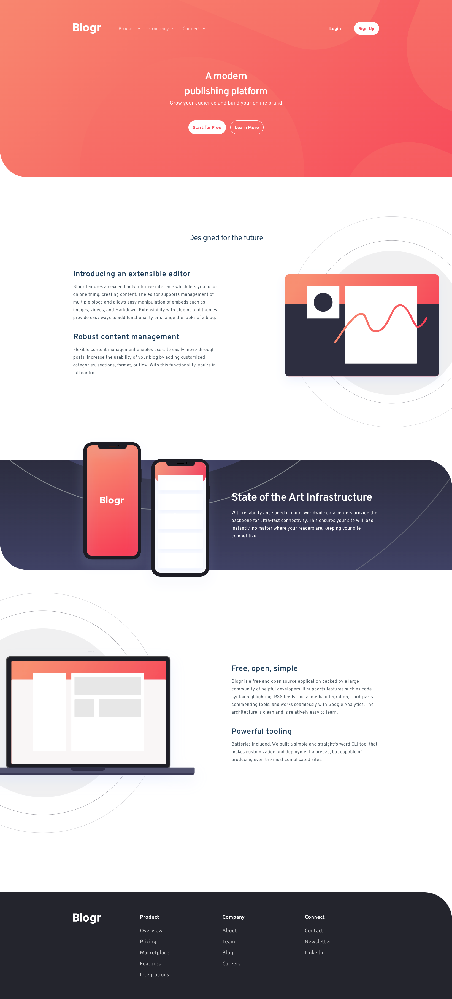

# Frontend Mentor - Blogr landing page solution

This is a solution to the [Blogr landing page challenge on Frontend Mentor](https://www.frontendmentor.io/challenges/blogr-landing-page-EX2RLAApP). Frontend Mentor challenges help you improve your coding skills by building realistic projects.

> Users should be able to:
>
> - View the optimal layout for the site depending on their device's screen size
> - See hover states for all interactive elements on the page

- [Solution URL](https://github.com/edwardnguyen225/frontendmentor-blogr)
- [Live Site URL](https://blogr.trinhan.xyz/)




## Table of contents

- [Frontend Mentor - Blogr landing page solution](#frontend-mentor---blogr-landing-page-solution)
  - [Table of contents](#table-of-contents)
  - [Project Setup](#project-setup)
    - [Compile and Hot-Reload for Development](#compile-and-hot-reload-for-development)
    - [Type-Check, Compile and Minify for Production](#type-check-compile-and-minify-for-production)
  - [Lint with ESLint](#lint-with-eslint)
    - [Continued development](#continued-development)
  - [Author](#author)

## Project Setup

```sh
bun install
```

### Compile and Hot-Reload for Development

```sh
bun dev
```

### Type-Check, Compile and Minify for Production

```sh
bun build
```

## Lint with [ESLint](https://eslint.org/)

```sh
bun lint
```

### Continued development

- Not thinking of yet

## Author

- Website - [Nhan Nguyen](https://trinhan.xyz)
- Frontend Mentor - [@edwardnguyen225](https://www.frontendmentor.io/profile/edwardnguyen225)
